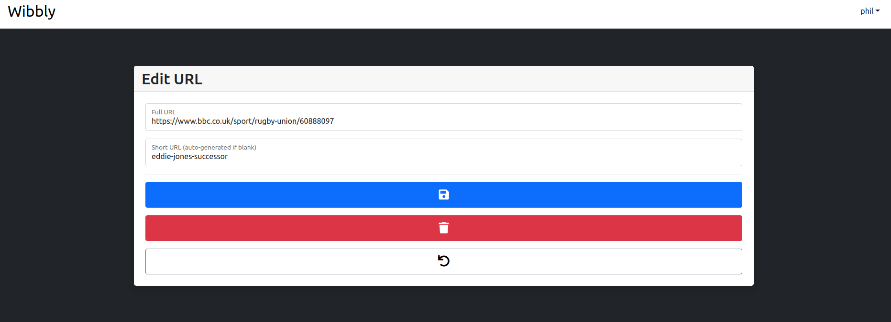

# URL Shortener



This is a simple URL shortener, which is my first CRUD application using Java.

My aim with the project was to keep things relatively simple, using it as an opportunity to learn Java, Spring Boot and
JUnit while creating a simple application I could add to my portfolio.

**[See a live demo here!](https://weather-phil.netlify.app/)** - please note that because it is hosted on the Heroku
free tier, if it hasn't been used for a while it can take the page a few seconds to load while it waits for the server
to start up. After that though, everything runs as normal.

Key features:

- Authentication
- Redirects short to full URLs
- Create, edit and delete your own short URLs
- Randomly generated or customisable short URLs
- Tracks the number of clicks on each URL

## Technologies used

| Purpose                    | Technology                             |
|:---------------------------|:---------------------------------------|
| Language                   | Java                                   |
| Front end                  | Thymeleaf, Bootstrap, Alpine           |
| Back end                   | Spring Boot, Hibernate, PostgreSQL     |
| Linting/Static code checks | PMD, Google Java Style Guide Formatter |
| Testing                    | JUnit, Mockito                         |
| CI/CD                      | Github Actions, Heroku                 |

## Getting started

```bash
# clone the repositories to your local machine with either
git clone git@github.com:PhilipVigus/url-shortener.git
```

### Starting the app locally

The following assumes you have Maven set and can run it from the command-line

```bash
# start the application, which will be accessible on http://localhost:8080/
mvn spring-boot:run
```

## Testing

```bash
mvn test
```

## My approach

As commented in the introduction, this project is deliberately bare-bones, and was intended as a way for me to learn to
use the stack it is built with following best practice as much as I could. The design is deliberately simple, with the
minimum functionality required to allow me to do this.

Simple authentication and authorisation are implemented, with values stored in the PostgreSQL database, but a lot of the
functionality you would generally expect to be there, such as changing passwords was deliberately left out.

The algorithm used to generate the unique short URLs is also deliberately simple. I am aware of some of its
shortcomings, but felt that a more complex approach was not the point of the project.

## Challenges

### Tests

By far the greatest challenge I faced during the project was learning how to write integration and to a lesser extent,
unit tests. For example, it took a while to work out how to set up controller tests to properly work with
authentication and authorisation.

Coming from a PHP/Laravel background, much of the detail of that is abstracted away to an extent I didn't realise, and
it was interesting and instructive to go through the process of setting integration tests up.

The test code went through a number of iterations and simplifications to get to the point it's now at, but I'm certain
that more can be done. For example, I am making a lot of use of the @SpringBootTest annotation, which adds significant
startup/teardown times. I've since read in a few places of approaches that might be applicable that would reduce how
often that annotation is used.

## Further work

- Allow unit and integration tests to be run separately
- Flesh out authentication
  - Remember me
  - Change password
  - Add email address so features like password resets can be implemented
- Add more detail to click statistics
  - Clicks over time graph
  - Clicks in last 24 hours
- Improve algorithm that calculates the short URL
- Allow csv uploads to bulk-generate URLs
- Optimise tests